# SchemaIQ


Shared Codex and Claude Code workflows for Azure SQL assessments, migrations, schema
review, performance, security and maintenance. AEF Core orchestration with dedicated
Azure, SQL and compliance specialists, pinned Microsoft
skills, local security skills, and an independently approved metadata-read broker.
Built for accounting teams and financial institutions. Public, tenant-neutral source. No credentials, tenant discovery or database access
happen during installation or planning.

**Status:** security-focused reference implementation, not an enterprise certification.
Live access defaults off. Deployment controls must pass [readiness checks](docs/security.md)
before production use. No write execution exists; schema changes are proposals only.

## Quick start (offline)

Requires Python 3.11+ and [uv](https://docs.astral.sh/uv/).

```sh
uv sync --locked --all-extras
uv run azure-sql-agent verify
uv run azure-sql-agent graph
uv run azure-sql-agent plan --policy config/example.json --action schema_inventory
uv run azure-sql-agent propose --kind add_nullable_column --table Orders --name ReviewedAt --type 'datetime2(7)'
uv run azure-sql-agent learn --outcomes config/learning-example.json
uv run pytest
```

Run from the repository root, or pass `--root /path/to/reviewed/checkout` before the
subcommand. Installation from this checkout uses the vendored AEF dependency via uv;
a standalone wheel does not bundle AEF or skills. See [provenance](docs/provenance.md).

## Codex and Claude skills

Start agents from this checkout. Ten local skills are discoverable by both hosts;
13 pinned Microsoft skills remain reference-only. Use
[agent setup and workflows](docs/agent-usage.md) and the
[Microsoft Learn control map](skills/local/references/microsoft-learn.md).

```sh
uv run azure-sql-agent guide --workflow performance
uv run azure-sql-agent guide --workflow migration
```

Guidance is offline. Performance collection, Azure CLI execution, migrations and
maintenance execution are unsupported. See [host acceptance cases](docs/agent-evaluation.md).

## Architecture

```mermaid
flowchart LR
  Task --> Orchestrator[AEF orchestration agent]
  Orchestrator --> Azure[Azure specialist]
  Azure --> SQL[SQL specialist]
  SQL --> Compliance[Compliance specialist]
  Compliance --> Plan[Offline review plan]
  Plan --> Human[Human reviewer: external signing key]
  Human --> Broker[Isolated broker: signature + policy + durable nonce]
  Broker --> ARM[Fixed Azure GET posture checks]
  ARM --> DB[Private endpoint: fixed SQL metadata queries]
  DB --> Result[Bounded metadata to stdout]
```



The four AEF nodes are deterministic specialists. They select domain controls and
produce a plan; no LLM provider, shell tool or autonomous remediation is configured.
Microsoft skill examples are reference content, never authority to run commands.
[Agent contracts](agents/orchestrator.md) document ownership and tool boundaries.

## What works

- Schema and index inventory from `sys.*` catalog views, at most 100 metadata rows.
- Fixed Azure logical-server/database/Entra posture reads before SQL connection.
- Ed25519 approvals bound to target, exact SQL, policy, skill/source hashes, limits
  and output destination; five-minute maximum lifetime; persistent single-use nonce.
- Offline nullable-column and nonclustered-index proposals with rollback cautions.
- Azure logical-server management guidance and assessment. No VM/host administration.

No arbitrary SQL, business-row exports, DDL execution, general Azure commands,
credential listing, approval bypass or self-issued approvals. For live setup, follow
[operator guide](docs/operator-guide.md). Treat returned metadata as confidential.

## Showcase and governed learning

[Website](https://andrewgoodson.github.io/schemaiq/) · [Learning contract](docs/learning.md)

AEF consolidates repeated, de-identified control outcomes into review candidates.
No automatic promotion, policy modification or model retraining. Write execution
remains absent even after a read approval; future write capability needs a separate
security-reviewed implementation and explicit user authorization.

The static `site/` showcase uses no analytics, external scripts, credentials or cloud
connections. GitHub Pages deploys only that directory.

[Validation evidence](docs/validation.md) records the tested scope and remaining deployment gates.

## Compliance review

The fourth AEF agent reviews SQL STIG coverage, NIST TLS evidence and financial
control applicability. `uv run azure-sql-agent guide --workflow compliance` prepares
an offline review. `uv run azure-sql-agent stig-register --benchmark FILE` inventories
every rule in a supplied XCCDF benchmark, initially NOT_ASSESSED. See
[compliance coverage](docs/compliance.md).

Generate an offline HTML control review in one command:

```sh
uv run azure-sql-agent compliance-report --benchmark /secure/review/benchmark-xccdf.xml --evidence /secure/review/findings.json --output /secure/review/compliance.html
```

This inventories every imported rule and displays supplied findings; it does not
scan a live database. Omit `--evidence` for a complete unassessed checklist.
