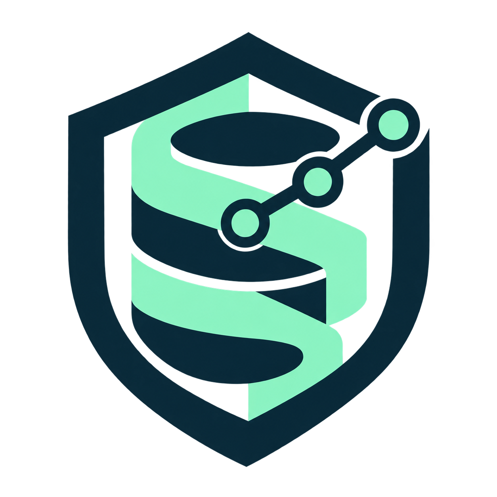

# SQLIQ

**Governed Azure SQL workflows for Codex and Claude Code.**

[Website](https://andrewgoodson.github.io/sqliq/) · [Getting started](docs/getting-started.md) · [Agent documentation](docs/agent-usage.md) · [Contributing](CONTRIBUTING.md) · [Security](SECURITY.md) · [MIT license](LICENSE)



Shared Codex and Claude Code workflows for Azure SQL assessments, migrations, schema
review, performance, security and maintenance. AEF Core orchestration with dedicated
Azure, SQL and compliance specialists, pinned Microsoft
skills, local security skills, and an independently approved metadata-read broker.
Built for accounting teams and financial institutions. Public, tenant-neutral source. No credentials, tenant discovery or database access
happen during installation or planning.

**Status:** security-focused reference implementation, not an enterprise certification.
Live access defaults off. Deployment controls must pass [readiness checks](docs/security.md)
before production use. Read-only is the default; supported writes require separate exact signed approval.

## Quick start (offline)

Clone this public repository:

```sh
git clone https://github.com/AndrewGoodson/sqliq.git
cd sqliq
```

Requires Python 3.11+ and [uv](https://docs.astral.sh/uv/).

```sh
uv sync --locked --group dev
uv run azure-sql-agent verify
uv run azure-sql-agent graph
uv run azure-sql-agent guide --workflow compliance
uv run azure-sql-agent plan --policy config/example.json --action schema_inventory
uv run azure-sql-agent propose --kind add_nullable_column --table Orders --name ReviewedAt --type 'datetime2(7)'
uv run azure-sql-agent learn --outcomes config/learning-example.json
uv run pytest
```

Run from the repository root, or pass `--root /path/to/reviewed/checkout` before the
subcommand. Installation from this checkout uses the vendored AEF dependency via uv;
a standalone wheel does not bundle AEF or skills. See [provenance](docs/provenance.md).

## Review your own Azure SQL database

Anyone can clone SQLIQ and run its offline workflows. Start with the
[database onboarding guide](docs/getting-started.md): select one database, establish
an evidence boundary, load the domain skills, and prepare a review with named owners.
A download does not grant access to Azure or install a production broker.

| Capability | Available today | Boundary |
|---|---|---|
| Codex and Claude skills | Shared local skills and Microsoft references | Host must load and apply them; instructions are not an OS sandbox |
| AEF Core graphs and hooks | Parallel Azure, SQL and compliance guidance; domain checks | Deterministic offline routing, not autonomous database assessment |
| Governed self-learning | De-identified repeated outcomes become review candidates | Human-reviewed promotion; no model retraining or automatic policy changes |
| NIST SP 800-52 Rev. 2 | [TLS evidence review](docs/nist-tls-review.md) | Separate from SQL STIGs and the SP 800-53 catalog |
| Compliance reports | HTML/PDF control registers, evidence and recommendations | Missing evidence remains NOT_ASSESSED; no live compliance scanner |
| Database reads and writes | Two fixed metadata reads; separate nullable-column write broker | Exact fresh externally signed approval and isolated deployment required |

For a first agent session, start Codex or Claude Code in this checkout and use:

```text
Use orchestration-security and sql-compliance-review for one Azure SQL Database.
Read docs/getting-started.md and run the offline compliance guide. Confirm the
skills and domain hooks selected. Ask for a redacted scope and approved evidence;
do not connect to Azure or SQL. Review applicable SQL STIGs, SP 800-53 controls,
and SP 800-52 Rev. 2 TLS evidence separately. Identify inherited, shared and
customer controls, missing evidence, recommendations, owners and approval needs.
Do not call an unassessed control passed. Produce a reviewable report.
```

Use [workflow selection](docs/agent-usage.md#select-a-workflow) for schema,
performance, migrations, maintenance and security. See [AI governance](docs/ai-governance.md)
for model use, data handling and token budgets.

## Codex and Claude skills

Start agents from this checkout. Ten local skills are discoverable by both hosts;
13 pinned Microsoft skills remain reference-only. Use
[agent setup and workflows](docs/agent-usage.md) and the
[Microsoft Learn control map](skills/local/references/microsoft-learn.md).

```sh
uv run azure-sql-agent guide --workflow performance
uv run azure-sql-agent guide --workflow migration
```

Guidance is offline. Performance collection, Azure CLI execution, migrations and
maintenance execution are unsupported. See [host acceptance cases](docs/agent-evaluation.md).

## Architecture

```mermaid
flowchart LR
  Task --> Orchestrator[AEF orchestration agent]
  Orchestrator --> Azure[Azure specialist]
  Azure --> SQL[SQL specialist]
  SQL --> Compliance[Compliance specialist]
  Compliance --> Plan[Offline review plan]
  Plan --> Human[Human reviewer: external signing key]
  Human --> Broker[Isolated broker: signature + policy + durable nonce]
  Broker --> ARM[Fixed Azure GET posture checks]
  ARM --> DB[Private endpoint: fixed SQL metadata queries]
  DB --> Result[Bounded metadata to stdout]
```



The diagram shows the metadata-plan and broker path. Offline `guide` workflows
use three parallel specialist graphs with domain hooks and an all-required join;
see [parallel domain reviews](docs/parallel-domain-reviews.md).

The four AEF nodes are deterministic specialists. They select domain controls and
produce a plan; no LLM provider, shell tool or autonomous remediation is configured.
Microsoft skill examples are reference content, never authority to run commands.
[Agent contracts](agents/orchestrator.md) document ownership and tool boundaries.

## What works

- Schema and index inventory from `sys.*` catalog views, at most 100 metadata rows.
- Fixed Azure logical-server/database/Entra posture reads before SQL connection.
- Ed25519 approvals bound to target, exact SQL, policy, skill/source hashes, limits
  and output destination; five-minute maximum lifetime; persistent single-use nonce.
- Offline nullable-column and nonclustered-index proposals with rollback cautions.
- Azure logical-server management guidance and assessment. No VM/host administration.

No arbitrary SQL, business-row exports, unapproved DDL execution, general Azure commands,
credential listing, approval bypass or self-issued approvals. For live setup, follow
[operator guide](docs/operator-guide.md). Treat returned metadata as confidential.

## Showcase and governed learning

[Website](https://andrewgoodson.github.io/sqliq/) · [Learning contract](docs/learning.md)

AEF consolidates repeated, de-identified control outcomes into review candidates.
No automatic promotion, policy modification or model retraining. Read approvals cannot authorize writes. Supported nullable-column additions require
a separate exact signed write approval; see [approved writes](docs/approved-writes.md).

The static `site/` showcase uses no analytics, external scripts, credentials or cloud
connections. GitHub Pages deploys only that directory.

[Validation evidence](docs/validation.md) records the tested scope and remaining deployment gates.

## Compliance review

The fourth AEF agent reviews SQL STIG coverage, NIST TLS evidence and financial
control applicability. `uv run azure-sql-agent guide --workflow compliance` prepares
an offline review. `uv run azure-sql-agent stig-register --benchmark FILE` inventories
every rule in a supplied XCCDF benchmark, initially NOT_ASSESSED. See
[compliance coverage](docs/compliance.md).

Generate an offline HTML control review in one command:

```sh
uv run azure-sql-agent compliance-report --benchmark /secure/review/benchmark-xccdf.xml --evidence /secure/review/findings.json --output /secure/review/compliance.html
```

Generate a PDF audit evidence report, with SQLIQ and your company logo on every page:

```sh
uv run azure-sql-agent compliance-report \
  --benchmark /secure/review/benchmark-xccdf.xml \
  --evidence /secure/review/findings.json \
  --format pdf \
  --company-logo /secure/review/company-logo.png \
  --company-name "Your organization" \
  --output /secure/review/sql-stig-audit.pdf
```

Every benchmark rule receives a result, source identifiers, requirement, check
instructions, evidence reference, reviewer, rationale and remediation guidance.
Results distinguish **PASS**, **FAIL**, **NOT_APPLICABLE** and **NOT_ASSESSED**.
Missing evidence never becomes a pass. Imported instructions are displayed, never executed.

DISA SQL STIGs and NIST SP 800-52 TLS guidance are separate sources. Complete
coverage means every rule in the supplied benchmark, not certification against all
NIST or financial obligations. Azure inheritance requires service-specific assurance.

This inventories every imported rule and displays supplied findings; it does not
scan a live database. Omit `--evidence` for a complete unassessed checklist.

## IT and board briefing

```sh
mkdir -p output/pdf
uv run azure-sql-agent board-report --output output/pdf/sqliq-it-board-briefing.pdf
```

Public proposal covering inherited Azure assurance, customer duties, AI governance
and token efficiency. No customer assessment is implied. See [AI governance](docs/ai-governance.md).

## Approval-gated writes

Read-only by default. [Separate signed write approval](docs/approved-writes.md)
authorizes one supported nullable-column addition. No arbitrary SQL or automatic
remediation. Live deployment and write behavior remain unverified.

Reports include the SQLIQ logo. Add `--company-logo /private/logo.png` and
`--company-name "Your organization"` to `board-report` for co-branding on every page.
See [report branding and AI governance](docs/ai-governance.md).

## Enterprise adoption

Start with the [NIST, banking and accounting framework register](docs/framework-register.md)
for applicability and explicit coverage gaps.

Use the [enterprise readiness register](docs/enterprise-readiness.md) to assign
owners and evidence for vulnerability assessment, access controls, financial change
management, reconciliation, recovery, provider assurance and AI governance.
SOX/ICFR, GLBA and PCI DSS applicability must be determined separately for each company.
Production acceptance remains unverified until deployment gates and independent
review are complete. The repository does not certify regulatory compliance.

## Contributing and support

Contributions are welcome. Start with [CONTRIBUTING.md](CONTRIBUTING.md), preserve
approval boundaries, and include tests and source provenance for security changes.
Report vulnerabilities through [SECURITY.md](SECURITY.md); do not post credentials,
customer evidence or sensitive database metadata in public issues.

For reproducible local validation:

```sh
uv run pytest
uv run ruff check src tests scripts
uv run azure-sql-agent verify
```

Licensed under [MIT](LICENSE). Vendored and referenced projects retain their own
licenses and attribution; see [provenance](docs/provenance.md).

## Full NIST and SQL STIG coverage

The pinned catalog includes **1,196 NIST SP 800-53 Rev. 5.2.0 controls and
enhancements**, including 182 withdrawn entries retained for traceability, and
**102 DISA SQL Server 2022 rules** across the database and instance benchmarks.
Every entry retains its source reference, requirement, assessment instructions and
available source guidance. NIST entries add Azure service responsibility and
implementation/evidence starting points across all 20 control families.

```sh
uv run azure-sql-agent compliance-report --catalog all --output assessment.html
uv run azure-sql-agent compliance-report --catalog all --format pdf --output assessment.pdf
```

Add `--evidence FINDINGS_JSON` for scoped operator findings and PDF
`--company-logo customer.png --company-name "Your company"` for dual branding.
Without evidence, all 1,298 entries remain **NOT_ASSESSED**. This command produces
an offline evidence register; it does not scan databases or certify compliance.
Full catalog coverage does not establish that every control applies to every SQL
service, nor cover every NIST publication or banking/accounting obligation.

See [NIST coverage](docs/nist-coverage.md), [SQL STIG coverage](docs/stig-coverage.md)
and the [financial applicability register](docs/framework-register.md).
